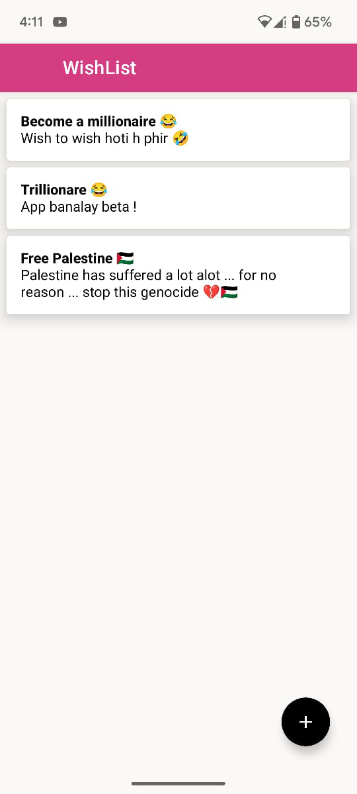
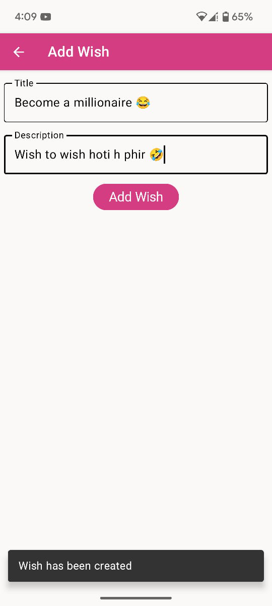

# 📱 WishList App

**WishList** is a minimal and intuitive Android app built with **Jetpack Compose** and **Room Database**, enabling users to create, update, and delete personal wishes. Whether it's something you want to buy or achieve, keep track of your goals all in one place.

---

## 🧱 Features

- 🏠 **Home Screen**  
  View all saved wishes from the local database in a clean list.

- ➕ **Add/Edit Wish**  
  Add a new wish or update an existing one with a simple form.

- 🧹 **Swipe to Delete**  
  Swipe left on a wish to remove it with visual feedback.

- 🧭 **Navigation**  
  Smooth navigation between screens using `NavController`.

- 🗃️ **Local Database**  
  Persistent data storage using Room (with DAO, Entity, and Database).

- 📐 **Material Design UI**  
  Built with Jetpack Compose using modern design components like `Scaffold`, `TopAppBar`, and `FloatingActionButton`.

---

## 🛠️ Tech Stack

- **Language:** Kotlin  
- **UI:** Jetpack Compose  
- **Architecture:** MVVM (Model-View-ViewModel)  
- **Database:** Room  
- **Navigation:** Jetpack Navigation Compose  
- **State Management:** ViewModel + StateFlow  

---

## 🚀 How It Works

### 🏠 Home Screen
- Displays all wishes using a `LazyColumn`.
- Includes a `TopAppBar` with the app title.
- A `FloatingActionButton (FAB)` allows navigation to the Add/Edit screen.
- Swipe to delete functionality implemented with `SwipeToDismiss`.

### ✍️ Add/Edit Screen
- Two `TextField`s for wish title and description.
- A `Save` button to add or update the wish in the Room database.
- Back navigation with an `IconButton` in the `TopAppBar`.

---

## 📸 Screenshots (Optional)

> Add screenshots of your app in action here  
> Example:  
>   
> 

---

## 📦 Installation

1. Clone the repository:

   ```bash
   git clone https://github.com/mashhukhangandapur/wishlistApp.git
   cd wishlistApp
